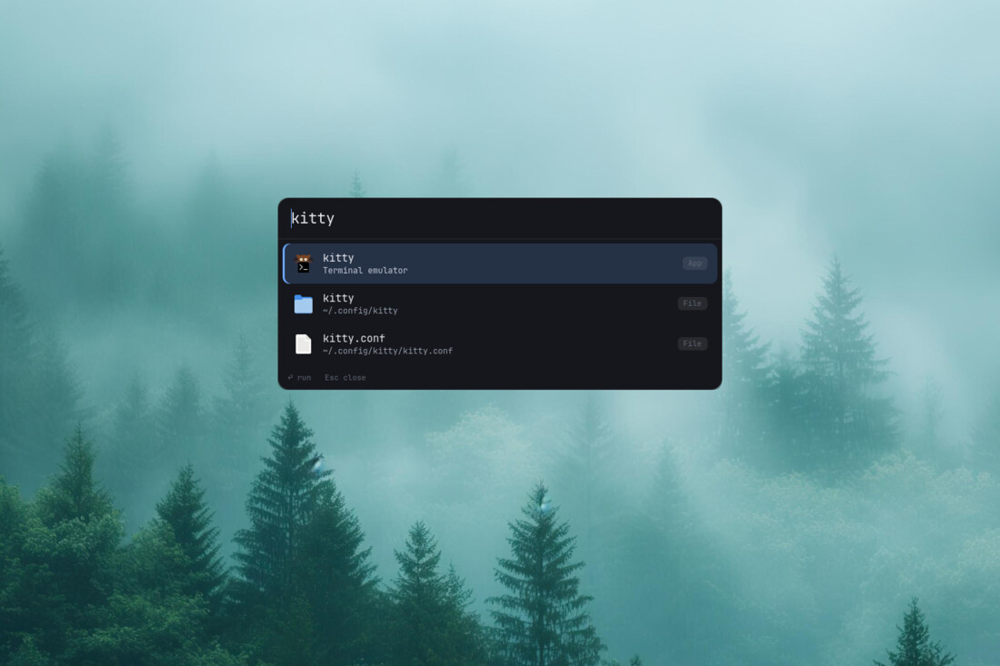
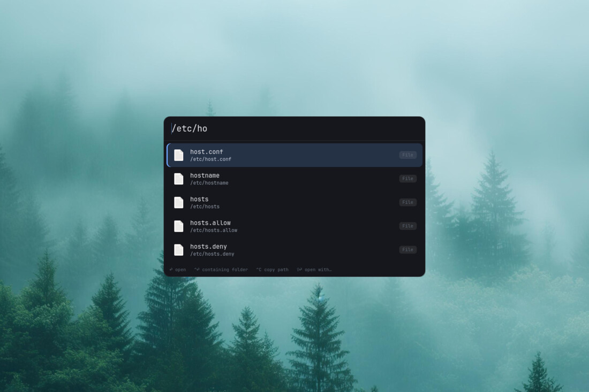
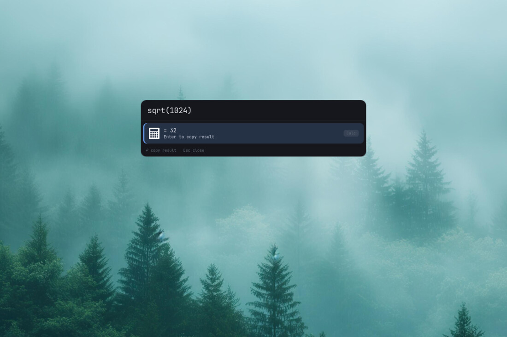

# sponux

Легковесный лаунчер для Linux в духе Spotlight, на Python + GTK 4.

*[English](README.md)*

- **Поиск и запуск приложений** — нативно, через `Gio.AppInfo`: иконки и
  правильный запуск достаются бесплатно. То, что вы открываете часто,
  поднимается наверх.
- **Поиск файлов** — мгновенный, на небольшом собственном SQLite-индексе имён
  файлов в домашнем каталоге, который поддерживается в актуальном состоянии
  через inotify. Что в него входит — настраивается, вплоть до отдельных
  деревьев. Всё, что вне индекса, достигается набором пути.
- **Калькулятор** — наберите выражение (`2+2*10`, `sqrt(2)`, `sin(pi/2)`) и
  нажмите Enter, чтобы скопировать результат. Безопасный вычислитель, без
  `eval()`.

Работает как резидентный демон в единственном экземпляре: первый запуск
поднимает его, каждый следующий вызов `sponux` переключает окно примерно за
20 мс.

## Скриншоты

Приложения и файлы в одном списке — метка справа говорит, что есть что:



Набранный путь дополняется, и индекс тут не участвует. `/etc` не индексируется
вообще, и это не нужно:



Арифметика, вычисляемая обходом AST, а не вызовом `eval()`. Enter копирует
результат:



## Документация

| | |
| --- | --- |
| **Руководство пользователя** | [English](docs/user-guide.en.md) · [Русский](docs/user-guide.ru.md) |
| Справочник | `man sponux` |

Руководства покрывают установку, горячую клавишу, автозапуск, все клавиши и
префиксы запроса, оба файла настроек и что делать, когда что-то ведёт себя не
так. Всё, что ниже, — краткая версия плюс то, что нужно для сборки.

## Требования

Debian/Ubuntu:

```sh
sudo apt install python3-gi python3-gi-cairo gir1.2-gtk-4.0
```

Сторонних зависимостей Python нет — кроме PyGObject sponux использует только
стандартную библиотеку. Пакеты выше стоят ~3 МБ; это биндинги к рантайму GTK 4
(~43 МБ), который и так уже стоит, если в системе есть хоть одно приложение на
GTK 4. Сам sponux — пакет на 42 КБ, 139 КБ установленных.

## Установка

**Debian / Ubuntu** — пакет объявляет зависимости сам:

```sh
sudo apt install ./sponux_0.1.0-1_all.deb
```

**Где угодно ещё** — устанавливать нечего. Распакуйте и запускайте:

```sh
tar xf sponux-0.1.0.tar.gz -C ~/opt
~/opt/sponux-0.1.0/bin/sponux
```

Либо клонируйте этот репозиторий и запускайте `bin/sponux` из него — то же самое.

`bin/sponux` находит пакет рядом с собой, так что привяжите горячую клавишу к
этому пути — и всё; удаление сводится к удалению каталога. Ту же самую обёртку
`.deb` кладёт в `/usr/bin`, где она находит пакет в `/usr/share/sponux`; из
wheel пакет уже лежит на `sys.path`.

Остальное — в руководстве: [English](docs/user-guide.en.md),
[Русский](docs/user-guide.ru.md).

## Быстрый старт

Привяжите горячую клавишу к команде `sponux`; правила для оконного менеджера не
нужны.

```
bindsym $mod+d exec --no-startup-id sponux         # i3
exec_always --no-startup-id sponux --daemon        # …и запуск при входе в систему
```

| Клавиша | Действие |
| --- | --- |
| набор текста | поиск приложений / файлов / вычисления |
| ↑ / ↓ | перемещение по списку |
| Enter | запустить / открыть / скопировать результат |
| Ctrl+Enter | открыть папку, содержащую файл |
| Ctrl+C | скопировать путь к файлу |
| Shift+Enter | открыть с помощью… (и при желании запомнить) |
| Esc | скрыть окно |
| Ctrl+Q | завершить демон |

Префиксы сужают поиск: `f:` файлы, `a:` приложения, `c:` или `=` калькулятор, а
ведущий `/` или `~/` дополняет путь вместо поиска. И клавиши, и префиксы
показаны в самом окне, так что запоминать ничего не нужно.

Настройки — два необязательных файла в `~/.config/sponux/`: `config.toml` для
поведения, `style.css` для внешнего вида. `sponux --write-config` создаёт
заготовки с комментариями.

```sh
sponux --which ~/.config/i3/config   # чем и почему откроется этот файл
sponux --check                       # проверить config.toml
sponux --reindex                     # перестроить индекс файлов сейчас
```

## Сборка пакетов

```sh
python3 tools/mkdeb.py         # dist/sponux_0.1.0-1_all.deb   (нужен dpkg-deb)
python3 tools/mktarball.py     # dist/sponux-0.1.0.tar.gz      (распаковать и запускать)
python3 tools/mkwheel.py       # dist/sponux-0.1.0-py3-none-any.whl
```

Чистый Python, поэтому все три не зависят от архитектуры и все три читают
метаданные из `pyproject.toml` и `packaging/changelog`. `mkdeb.py` содержит
раскладку установки — это единственное, что вообще где-то устанавливает sponux.
Архив несёт только то, что нужно для *запуска*: ни сборочных скриптов, ни
тестов, ни метаданных пакета. И `.deb`, и архив воспроизводимы — две сборки
одного дерева побайтово идентичны.

Если доступен setuptools, `python3 -m build` даёт тот же wheel. Учтите: точка
входа `sponux` из wheel — это *Python*-скрипт, поэтому она платит ~230 мс на
`import gi` при каждом нажатии вместо ~20 мс у обёртки. И `.deb`, и
распакованное дерево используют `bin/sponux`, который общается с демоном через
D-Bus.

## Тесты

```sh
python3 tests/test_placement.py   # размещение на нескольких мониторах, на поддельных мониторах
python3 tests/test_index.py       # правила индекса + живые обновления через inotify
python3 tests/test_config.py      # правила [open], запись конфига, dotfiles
python3 tests/test_usage.py       # кривая frecency и её влияние на результаты
python3 tests/test_query.py       # префиксы вида и дополнение набранного пути
python3 tests/test_docs.py        # два руководства: паритет, ссылки, задокументированные флаги
python3 tools/bench.py installed  # задержка открытия установленного sponux
python3 tools/visual.py /tmp/shots  # снимок настоящего окна
```

## Структура

```
sponux/
  app.py            окно GTK4, клавиши, действия, жизненный цикл приложения
  placement.py      подсказки EWMH + центрирование, чтобы не нужны были правила WM
  indexer.py        SQLite-индекс имён: правила, inotify, периодическое перестроение
  usage.py          что открывалось и какую прибавку это даёт при ранжировании
  userconfig.py     config.toml и style.css, и запись правил обратно
  config.py         пути и значения по умолчанию
  style.css         тёмный вид, целиком на переменных CSS
  providers/
    base.py         тип Result + нечёткое сравнение + буфер обмена
    apps.py         приложения рабочего стола (Gio.AppInfo)
    files.py        поиск файлов, набранные пути, открытие, показ в папке, открыть с помощью
    calc.py         безопасный арифметический калькулятор
bin/sponux          обёртка, которую запускает горячая клавиша; быстрый путь через D-Bus
docs/               руководство пользователя, английское и русское
packaging/
  io.github.sponux.desktop   элемент рабочего стола
  sponux.1                   страница man
  changelog, copyright       данные для сборки Debian-пакета
tools/
  mkdeb.py, mktarball.py, mkwheel.py, metadata.py   сборки
  bench.py, visual.py                 задержки и снимки настоящего окна
tests/
  test_*.py                           проверки; каждая запускается отдельно
```

`packaging/` и `tools/` — входные данные для сборки: ничто из того, что нужно
для *запуска* sponux, их не читает. Для запуска достаточно `sponux/` и `bin/`.

## Лицензия

MIT — см. [LICENSE](LICENSE).
